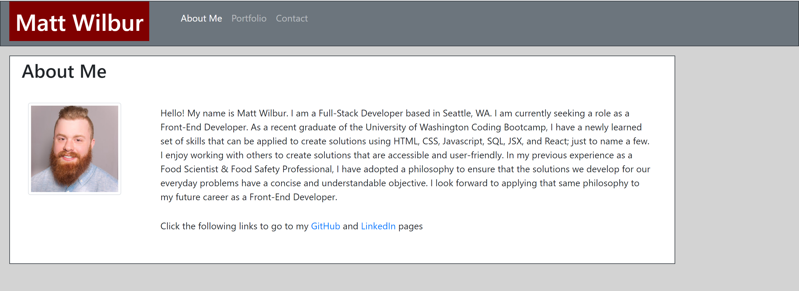
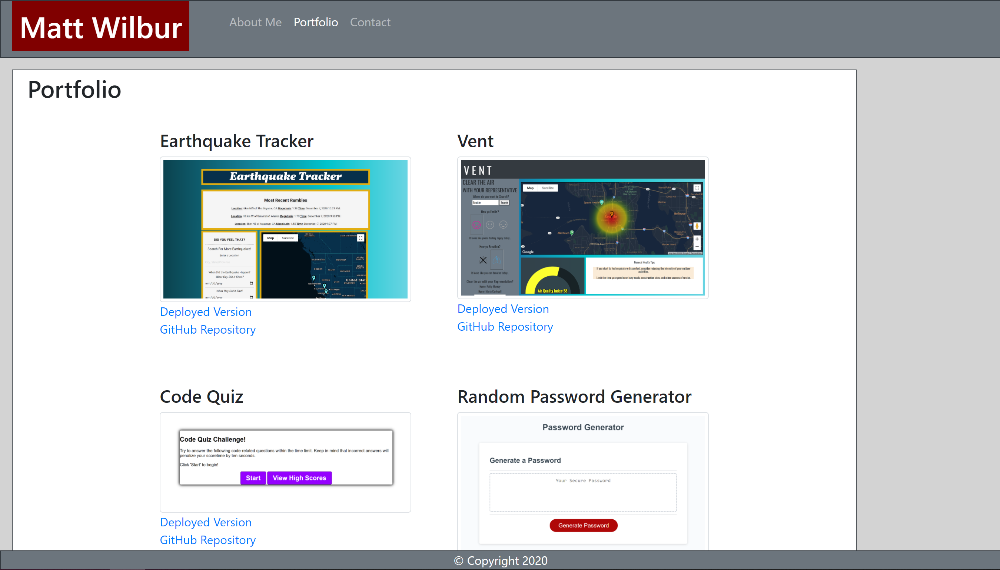

# Responsive_Portfolio

URLs: https://wilbur125.github.io/Responsive_Portfolio/

This is a mobile responsive portfolio using the Bootstrap CSS Framework. 
The portfolio contains 3 HTML pages: About Me, Portfolio, and Contact.
Screenshots demonstrating the responsive formatting can be found in the Screenshots Folder. 
All URLs have been validated using W3 Validation Tool.

I recently updated my portfolio to include recent projects and coding examples. 

